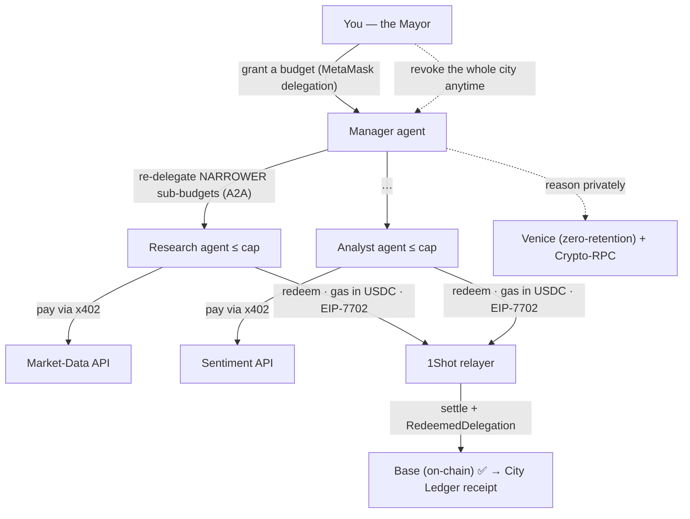

# Agent City — a spending firewall for autonomous AI agents

> Built for the **MetaMask Smart Accounts Kit × 1Shot API × Venice AI Dev Cook-Off** (HackQuest).
>
> **A spending firewall for AI agents.** Hand an autonomous agent a funded wallet without the fear: a
> **private model (Venice) must approve every payment _before_ the money can move**, and the budget itself
> is a **MetaMask delegation the agent physically cannot exceed** — exceed it and the transaction reverts.
> **Two locks: a private brain that says _whether_, an on-chain cap that says _how much_. Neither trusted; both enforced.**
>
> The live demo, **Agent City**, makes it concrete: you grant a budget, a **Manager** agent re-delegates
> **narrower** sub-budgets to worker agents (A2A), each clears the **Venice spend-gate** then pays for data
> via **x402**, settled gaslessly through the **1Shot** permissionless relayer — every payment an on-chain
> receipt, revocable in one click. **The delegation _is_ the cap; the private gate _is_ the approval.**

## Proven on-chain — not a mock

The hard parts are redeemed on **Base** (testnet **and** mainnet). Reproduce with `npm run city` /
`npm run prove*`. Raw run logs + relayer receipts are pinned in **[docs/proofs/](./docs/proofs/)**.

| Capability | Track | Evidence (open it) |
|---|---|---|
| **Agents hire agents** — Manager → worker capped sub-budgets (A2A redelegation) | Best A2A | Base Sepolia tx [`0x24af…ae27`](https://sepolia.basescan.org/tx/0x24af8650b5690755e4dfad5d16947c06d753257348872c9bd73bbad8d6b2ae27) — 6 `RedeemedDelegation` events, root + narrower child caps |
| **Agents pay agents** — x402 pay-per-call settled as an ERC-7710 redemption | Best x402 + ERC-7710 | Base Sepolia tx [`0xbbce…450b`](https://sepolia.basescan.org/tx/0xbbcecb7cbe662462794cf5cee1c7dcbf3eba22b9669e902f5b8bfb3b1272450b) — service received 0.05 USDC |
| **Gasless settlement** — every spend redeems via 1Shot, gas in USDC, EIP-7702 | Best 1Shot | **Base mainnet** tx [`0x0349…448bf`](https://basescan.org/tx/0x0349304adead048d8392722e4b89b81914c42599f2fa250078ef0b1980c448bf) + Base Sepolia gate |
| **Spend under an ERC-7715 grant** — periodic granted context, decoded + redeemed | Best Agent / qualification | Base Sepolia tx [`0xaa84…197b`](https://sepolia.basescan.org/tx/0xaa84871ebefcd49d61fa091c3ac9e77a5037e632ee588c3cacc38a42127c197b) — `erc20-token-periodic` enforcer accepted the spend |
| **Private spend-gate** — a Venice model must approve each spend *before* the on-chain redelegation fires (**fail-closed**: no approval ⇒ no spend) | Best Venice | `npm run city` — per-agent gate verdict on every payment; GLM-4.7 zero-retention + Venice Crypto-RPC reads |
| **Bounded autonomous agent** — reason → propose → act under a hard cap, HITL | Best Agent | `src/agent/planner.ts` + the live City flow |

Treasury EOA `0x1DC366A33BaA610eA5A60Ba549f619126e590601` is EIP-7702-upgraded on both networks
(`getCode → 0xef0100…dae32b`). Full hash list: [docs/proofs/](./docs/proofs/).

## How the city runs



Full component breakdown: **[docs/architecture.md](./docs/architecture.md)**.

## MetaMask integration — honest status

- **What qualifies today (main flow):** the city redeems **MetaMask Smart Account** delegations
  (`Implementation.Stateless7702`, ERC-7710) on every spend — the budget, the A2A sub-budgets, and the
  x402 payments are all scoped MetaMask delegations enforced on-chain. Built with `@metamask/smart-accounts-kit`.
- **Advanced Permissions (ERC-7715) — wired end-to-end:** the Mayor grants the agent a periodic USDC
  budget at **`/grant`** (`wallet_requestExecutionPermissions`, `erc20-token-periodic`). The returned
  hex **context is validated + decoded** (`src/delegation/grantBridge.ts`, Kit `decodeDelegations`) and
  **every city payment then chains UNDER the grant**: `your wallet →(periodic grant)→ manager →(masterCap)→
  worker →(subCap)→ relayer` — so the city spends the granting wallet's funds, bounded by the on-chain
  periodic enforcer. **Redemption-under-grant is proven on-chain**: `npm run prove:grant` redeems beneath a
  granted context in MetaMask's exact wire format (same scope, same `encodeDelegations` encoding) — Base
  Sepolia tx [`0xaa84…197b`](https://sepolia.basescan.org/tx/0xaa84871ebefcd49d61fa091c3ac9e77a5037e632ee588c3cacc38a42127c197b).
  ⚠️ Honest residual: that proof signs the grant with a local key; the **interactive Flask popup** produces
  the same context shape and flows through the same `parseGrant` boundary, but we have not yet run the
  popup itself end-to-end (Flask-only). `npm run grant:dev` exercises the grant-active flow without Flask.

## Run it

```bash
npm install
npm test            # 57 passing
npm run typecheck   # tsc --noEmit (clean)

# Live (needs .env — see below), all real on Base Sepolia:
npm run city        # Agent City: Manager hires workers, each buys an x402 service, settles on-chain
npm run dev         # web app: http://localhost:8787  (landing /, City /app, grant /grant)
npm run grant:dev   # post a synthetic ERC-7715 grant to the dev server (demo the grant flow sans Flask)
npm run prove       # minimal de-risk: one delegation redeemed via 1Shot
npm run prove:a2a   # A2A: a 2-link redelegation chain redeemed on-chain
npm run prove:x402  # x402: a 402 pay-per-call settled on-chain as a 7710 redemption
npm run prove:grant # ERC-7715 bridge: redeem UNDER a granted periodic context (MetaMask wire format)
npm run demo        # the single-agent loop (Venice → policy → approval → 1Shot)
```

Copy `.env.example` → `.env`: `VENICE_API_KEY`, `RPC_URL`, `CHAIN` (`baseSepolia` | `base`),
`SIGNER_PRIVATE_KEY` (a **throwaway** signer — never commit `.env`, it is git-ignored).

## Honest scope notes (so judges don't have to guess)

- **x402:** settlement is a real on-chain **ERC-7710 redemption** (the track thesis), not canonical
  Coinbase x402 (EIP-3009). The demo's 402 gate unlocks on payment submission and verifies settlement
  on-chain out-of-band (`balanceOf`); it does not yet cryptographically verify the `X-PAYMENT` proof.
- **1Shot status:** settlement is **webhook-push-first** — `POST /webhooks/1shot` receives 1Shot status
  events, **verifies the Ed25519/JWKS signature** (`src/webhook.ts`, forged signatures → 401), and the
  orchestrator's `settle()` reads that inbox **before** falling back to `relayer_getStatus` polling
  (`src/city/webhookInbox.ts`). Polling remains the fallback so the demo works even when 1Shot can't reach
  a localhost callback URL.
- **Reputation:** agent credit is derived from the **settled receipts' quoted price**; it is recomputed in
  memory per server session (the inputs are the on-chain receipts).
- A full third-party audit (multi-agent) lives at **[docs/AUDIT.md](./docs/AUDIT.md)** — we ran it on
  ourselves and fixed the security + correctness findings.

## Layout

```
src/city/          the Agent City orchestrator, x402 service market, reputation, live wiring
src/delegation/    MetaMask smart account (Stateless7702) + scoped delegation + 7710 redemption + A2A redelegation
src/x402/          x402 client + DelegatedPayer (pay-per-call settled via the Executor)
src/agent/         the planner loop (reason → propose → policy → approval → execute) + policy gate
src/venice.ts      Venice reasoner (private model) · src/veniceRpc.ts  read the chain THROUGH Venice
src/relayer.ts     1Shot relayer JSON-RPC client · src/webhook.ts  Ed25519/JWKS receiver (unit-tested)
src/ui/            Onyx design system: landing (/), City app (/app), ERC-7715 grant (/grant)
scripts/           prove-delegation · prove-redelegation · prove-x402 · run-city · demo-live
```

## License

MIT — see [LICENSE](./LICENSE). Strategy: [PLAN.md](./PLAN.md) · build log: [BUILD_STATE.md](./BUILD_STATE.md) · audit: [docs/AUDIT.md](./docs/AUDIT.md).
