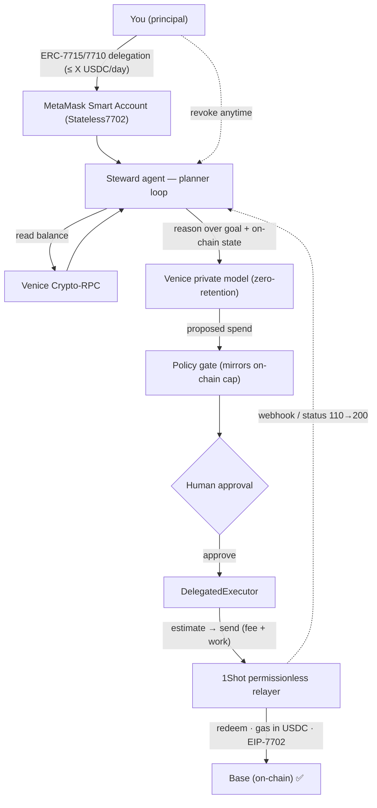

# Steward — an AI treasurer that can only ever spend inside cryptographic limits

> Built for the **MetaMask Smart Accounts × 1Shot API × Venice AI Dev Cook-Off** (HackQuest).
>
> Steward is an AI agent you can safely hand a budget to. It reasons **privately** with Venice, can spend
> only within a **MetaMask delegation** (a hard, on-chain cap), pauses risky actions for **your approval**,
> and executes **gaslessly through the 1Shot permissionless relayer** — and you can **revoke** it instantly.
>
> Every other "AI agent with a wallet" asks you to trust the agent with a key. Steward flips it: the agent
> never holds your keys and is *cryptographically incapable* of overspending. **The delegation _is_ the product.**

## ✅ Proven on-chain — not a mock

`npm run demo` runs the **entire product end-to-end** and confirms on Base Sepolia:

1. Venice reads the treasury balance **through its own Crypto-RPC** (`/crypto/rpc/base-sepolia`), then
2. the private model (`zai-org-glm-4.7`, `privacy: private` / zero data retention) **proposes** a spend, then
3. a bounded **policy gate + human approval** vet it, then
4. it redeems through the **1Shot relayer** — **gas paid in USDC**, EOA upgraded via **EIP-7702** — and
5. settles **status 200, confirmed on-chain**.

**Evidence (Base Sepolia):** the EOA `0x1DC3…0601` is upgraded to a 7702 stateless delegator
(`getCode → 0xef0100…dae32b`); USDC moved with the relayer fee paid in USDC; relayer task ids
`0x651c…b35d` and `0x46bf…6ae5` both reached status `200` with `RedeemedDelegation` events.
**A2A redelegation is proven the same way:** `npm run prove:a2a` redeems a **2-link chain** (principal
→ ≤1 USDC → a fresh manager → ≤0.5 USDC → the relayer) in tx `0x24af…ae27` — the manager EOA is
7702-upgraded on-chain and the `RedeemedDelegation` events show both links with their caps (1.0 then 0.5 USDC),
the narrower sub-budget enforced by the chain itself.
**x402 + ERC-7710 is proven too:** `npm run prove:x402` runs a real HTTP 402 pay-per-call — the agent
auto-pays 0.05 USDC as a 7710 redemption via 1Shot (tx `0xbbce…450b`) and the gated resource unlocks; the
fresh service address verifiably receives the 0.05 USDC on-chain (settled as a 7710 redemption — the track
thesis — not canonical EIP-3009 x402).

> Verified during development on Base Sepolia. **Reproduce it yourself** with the human end-to-end checklist
> in **[docs/TESTING.md](./docs/TESTING.md)** — `npm test`, then `npm run demo`, then `npm run dev`.
> **Also proven on Base mainnet** (the $1k 1Shot prize): `CHAIN=base npm run prove` redeemed on-chain —
> status **200**, tx [`0x0349…448bf`](https://basescan.org/tx/0x0349304adead048d8392722e4b89b81914c42599f2fa250078ef0b1980c448bf),
> the EOA EIP-7702-upgraded on mainnet (`getCode → 0xef0100…dae32b`), gas paid in USDC (~0.01 USDC fee), `RedeemedDelegation` emitted.

## The flow



> Full component breakdown: **[docs/architecture.md](./docs/architecture.md)**.

## How one build stacks the prize tracks

| Track | How Steward earns it |
|---|---|
| **Best Agent** | a real multi-step planner that reasons → proposes → acts under hard limits, with HITL approval |
| **Best Use of Venice AI** | private (zero-retention) reasoning **+** on-chain reads via Venice Crypto-RPC = core, multi-endpoint |
| **Best Use of 1Shot Relayer** | every spend redeems through the permissionless relayer — **USDC gas, EIP-7702, webhook**-verifiable status |
| **Best x402 + ERC-7710** | pay-per-call settled as a budgeted 7710 redemption — **proven on-chain** (`npm run prove:x402`: a real 402 call paid via 1Shot, see `src/x402/`) |
| **Best A2A Coordination** | manager → worker **redelegation** of capped sub-budgets — **proven on-chain** (`npm run prove:a2a`: a 2-link chain redeemed on Base Sepolia, see `src/delegation/redelegate.ts`) |

## Run it

```bash
npm install
npm test            # 41 passing: agent loop, policy, relayer client, delegation, x402, webhook, Venice RPC
npm run typecheck   # tsc --noEmit (clean)

# Live demo (needs .env, see below):
npm run demo        # headless: the whole loop, on-chain, with status polling
npm run dev         # web dashboard at http://localhost:8787 (LIVE, or keyless DryRun fallback)
npm run prove       # the minimal de-risk: one delegation redeemed on-chain via 1Shot
npm run prove:a2a   # A2A: a 2-link redelegation chain (principal→manager→relayer) redeemed on-chain
npm run prove:x402  # x402: a 402 pay-per-call settled on-chain as a 7710 redemption via 1Shot
```

Copy `.env.example` → `.env` and set:
- `VENICE_API_KEY` — Venice API key (a few $ of credits). Default model `zai-org-glm-4.7` (private).
- `RPC_URL` — an RPC for the chosen chain. `CHAIN=baseSepolia` (free de-risk) or `base` (mainnet).
- `SIGNER_PRIVATE_KEY` — a **throwaway** signer (the treasury). Never commit `.env` (git-ignored).

The 1Shot relayer needs no key; gas is paid in USDC. Testnet uses `relayer.1shotapi.dev`, mainnet `relayer.1shotapi.com` (auto-selected).

## Layout

```
src/venice.ts            Venice reasoner (OpenAI-compatible, private model; injectable for tests)
src/veniceRpc.ts         Venice Crypto-RPC client — read the chain THROUGH Venice
src/relayer.ts           1Shot relayer JSON-RPC client (capabilities/estimate/send/status)
src/webhook.ts           relayer webhook receiver — Ed25519 verification against the relayer JWKS
src/agent/policy.ts      bounded-budget policy gate (mirrors the on-chain caveats)
src/agent/planner.ts     the planner loop (resumable; human-in-the-loop approval)
src/delegation/          MetaMask smart account (Stateless7702) + scoped delegation + 7710 redemption + redelegation
src/live.ts              live composition root (brain + hands), used by `npm run demo` and the web server
src/api.ts · src/ui.ts   Hono API + self-contained demo dashboard
scripts/prove-delegation.ts   the on-chain de-risk
```

## Security

No secrets in source — the Venice key and the throwaway signer are read from env (`.env` is git-ignored).
Provider errors are sanitized (no key/stack leakage). The agent can never exceed the on-chain delegation
cap, and every value-moving action is gated behind human approval and instantly revocable.

## License

MIT — see [LICENSE](./LICENSE). Strategy + judging detail: [PLAN.md](./PLAN.md) · build log: [BUILD_STATE.md](./BUILD_STATE.md).
