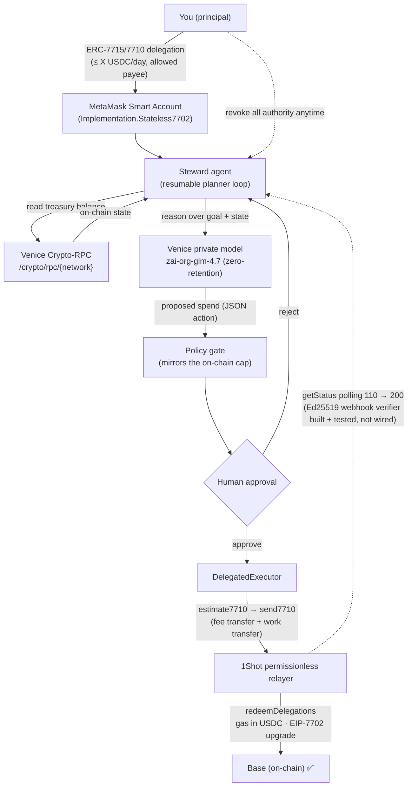

# Steward — Architecture

## Components

| File | Role |
|---|---|
| `src/agent/planner.ts` | The planner loop — reason → propose → (policy) → approval → execute → finalize. Resumable; pauses at the human gate. |
| `src/agent/policy.ts` | Off-chain budget gate that mirrors the on-chain delegation caveats, so the agent never proposes what the chain would reject. |
| `src/venice.ts` | Venice reasoner (OpenAI-compatible). Private model; `disable_thinking` suffix so reasoning models return clean JSON. |
| `src/veniceRpc.ts` | Reads the chain **through Venice** (`/crypto/rpc/{network}`) — Venice as a core, multi-endpoint dependency. |
| `src/delegation/smartAccount.ts` | Creates the `Stateless7702` smart account + the EIP-7702 upgrade authorization. |
| `src/delegation/delegation.ts` | Builds the scoped `Erc20TransferAmount` delegation (the on-chain budget), `to` = relayer `targetAddress`. |
| `src/delegation/redeem.ts` | Turns an action into the relayer's `permissionContext` (JSON-safe signed delegation chain) + `executions`. |
| `src/delegation/redelegate.ts` | A2A: manager → worker capped sub-budgets (nested caps via `parentDelegation`). |
| `src/delegation/executor.ts` | The redemption flow: capabilities → estimate (mock fee) → re-sign if needed → send. Path-agnostic via a `ContextResolver`. |
| `src/relayer.ts` | 1Shot relayer JSON-RPC client (`getCapabilities`/`getFeeData`/`estimate7710`/`send7710`/`getStatus`). |
| `src/webhook.ts` | Relayer webhook receiver — verifies Ed25519 signatures against the relayer JWKS (push status, not polling). |
| `src/x402/` | x402 pay-per-call settled as a budgeted 7710 redemption (reuses the Executor). |
| `src/live.ts` | Live composition root: wires brain + hands + on-chain context. Used by `npm run demo` and the web server. |
| `src/api.ts` · `src/ui.ts` | Hono API + the self-contained demo dashboard. |

## Two signing paths (one executor)

`DelegatedExecutor` takes a `ContextResolver`, so the same redemption code serves both:

- **`signingResolver(account)`** — a script/backend signer signs a fresh scoped delegation per redemption. Used by `npm run demo` / `npm run prove`.
- **`staticResolver(grantedContext)`** — reuse a wallet-granted EIP-7715 periodic budget across redemptions. The path a browser MetaMask grant would use.

## Why the relayer is the on-chain delegate

The 1Shot relayer redeems delegations made **to its `targetAddress`** (from `relayer_getCapabilities`). So the principal delegates to the relayer's redemption account; the relayer runs the bundled executions (a mandatory fee transfer to `feeCollector` + the work transfer) and charges gas in the stablecoin it parses from the fee leg. EIP-7702 upgrades the EOA in place so its delegations are redeemable.
