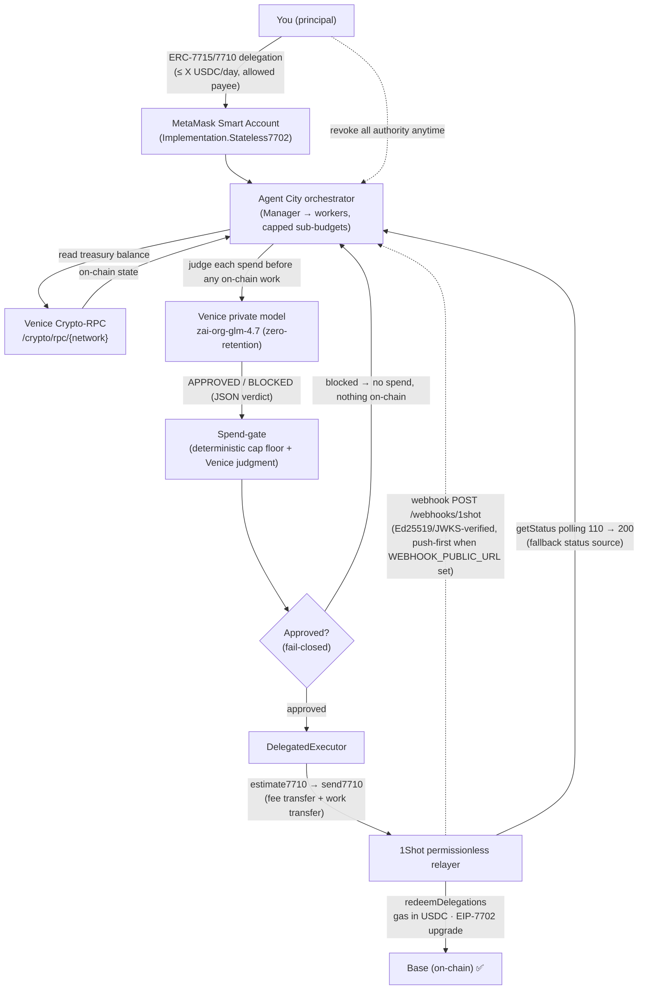

# Agent City — Architecture

## Components

| File | Role |
|---|---|
| `src/agent/planner.ts` | The single-agent planner loop (`Steward`) — reason → propose → (policy) → **human approval** → execute → finalize. Resumable; pauses at the human gate. Drives `npm run demo` (not the live Agent City `/app` flow, which is the deterministic orchestrator + Venice spend-gate below). |
| `src/agent/policy.ts` | Off-chain budget gate that mirrors the on-chain delegation caveats, so the planner never proposes what the chain would reject. |
| `src/city/spendGate.ts` | Agent City's per-spend gate: a deterministic cap floor (always enforced) **plus** a private Venice judgment. Each City payment must clear it **before** any on-chain redelegation fires; fail-closed (a gate error holds the spend). |
| `src/venice.ts` | Venice reasoner (OpenAI-compatible). Private model; `disable_thinking` suffix so reasoning models return clean JSON. |
| `src/veniceRpc.ts` | Reads the chain **through Venice** (`/crypto/rpc/{network}`) — Venice as a core, multi-endpoint dependency. |
| `src/delegation/smartAccount.ts` | Creates the `Stateless7702` smart account + the EIP-7702 upgrade authorization. |
| `src/delegation/delegation.ts` | Builds the scoped `Erc20TransferAmount` delegation (the on-chain budget), `to` = relayer `targetAddress`. |
| `src/delegation/redeem.ts` | Turns an action into the relayer's `permissionContext` (JSON-safe signed delegation chain) + `executions`. |
| `src/delegation/redelegate.ts` | A2A: manager → worker capped sub-budgets (nested caps via `parentDelegation`). |
| `src/delegation/executor.ts` | The redemption flow: capabilities → estimate (mock fee) → re-sign if needed → send. Path-agnostic via a `ContextResolver`. |
| `src/relayer.ts` | 1Shot relayer JSON-RPC client (`getCapabilities`/`getFeeData`/`estimate7710`/`send7710`/`getStatus`). |
| `src/webhook.ts` · `src/city/webhookInbox.ts` | Relayer webhook receiver — verifies Ed25519 signatures against the relayer JWKS. **Wired**: `POST /webhooks/1shot` (`src/api.ts`) records verified events into a push-first inbox that `settle()` (`src/city/orchestrator.ts`) reads **before** falling back to `getStatus` polling. Push is active when `WEBHOOK_PUBLIC_URL` is set (the relayer is told a `destinationUrl`); polling is the fallback otherwise. |
| `src/delegation/grantBridge.ts` | ERC-7715 bridge: validates + decodes a browser-granted permission context (Kit `decodeDelegations`); city payments then chain under the grant. |
| `src/city/` | Agent City: orchestrator (A2A sub-budgets → x402 purchases → on-chain receipts), service market, reputation, live wiring. |
| `src/x402/` | x402 pay-per-call settled as a budgeted 7710 redemption (reuses the Executor). |
| `src/live.ts` | Live composition root: wires brain + hands + on-chain context. Used by `npm run demo` and the web server. |
| `src/api.ts` · `src/ui/` | Hono API + the self-contained demo dashboard (`src/ui/app.ts` the `/app` City console, `src/ui/grant.ts` the ERC-7715 grant page, `src/ui/landing.ts` the `/` landing). |

## Two signing paths (one executor)

`DelegatedExecutor` takes a `ContextResolver`, so the same redemption code serves both:

- **`signingResolver(account)`** — a script/backend signer signs a fresh scoped delegation per redemption. Used by `npm run demo` / `npm run prove`.
- **`staticResolver(grantedContext)`** — reuse a wallet-granted EIP-7715 periodic budget across redemptions. The path the browser MetaMask grant uses: a `/grant` page POSTs the granted context to `/city/grant`, and every subsequent `/city/run` chains the workers' budgets under it (`src/delegation/grantBridge.ts` → `src/city/orchestrator.ts`).

## Why the relayer is the on-chain delegate

The 1Shot relayer redeems delegations made **to its `targetAddress`** (from `relayer_getCapabilities`). So the principal delegates to the relayer's redemption account; the relayer runs the bundled executions (a mandatory fee transfer to `feeCollector` + the work transfer) and charges gas in the stablecoin it parses from the fee leg. EIP-7702 upgrades the EOA in place so its delegations are redeemable.
